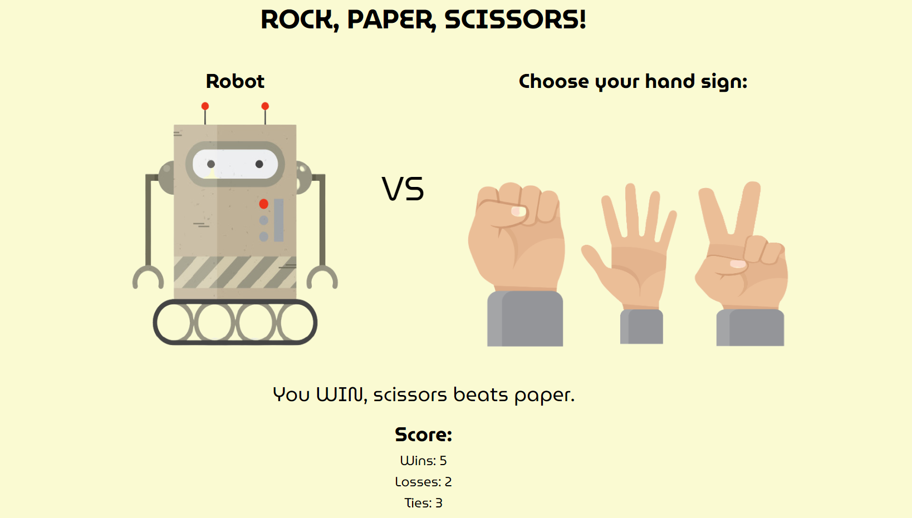

*README*

This project is an implementation of the classic game "Rock, Paper, Scissors" using HTML, CSS, and JavaScript, providing an interactive and entertaining experience for users.

The interface presents the title "ROCK, PAPER, SCISSORS!" prominently, inviting users to engage with the game.
Users are presented with images representing their choices (rock, paper, or scissors) and an image representing the computer's choice (robot).
Interactive Gameplay:

Users can click on the images to select their choice of hand sign (rock, paper, or scissors).
After the user makes a selection, the computer randomly chooses its hand sign.
The result of the round (win, lose, or tie) is displayed dynamically on the screen.

The game keeps track of the user's wins, losses, and ties, updating the score in real-time.
Users can see their performance and aim to improve their score with each round.

Clear and concise game rules are provided, explaining the basic rules of Rock, Paper, Scissors.
Users can refer to these rules to understand the game mechanics and make informed decisions during gameplay.
